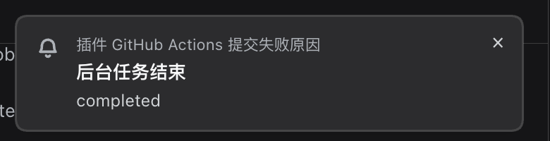
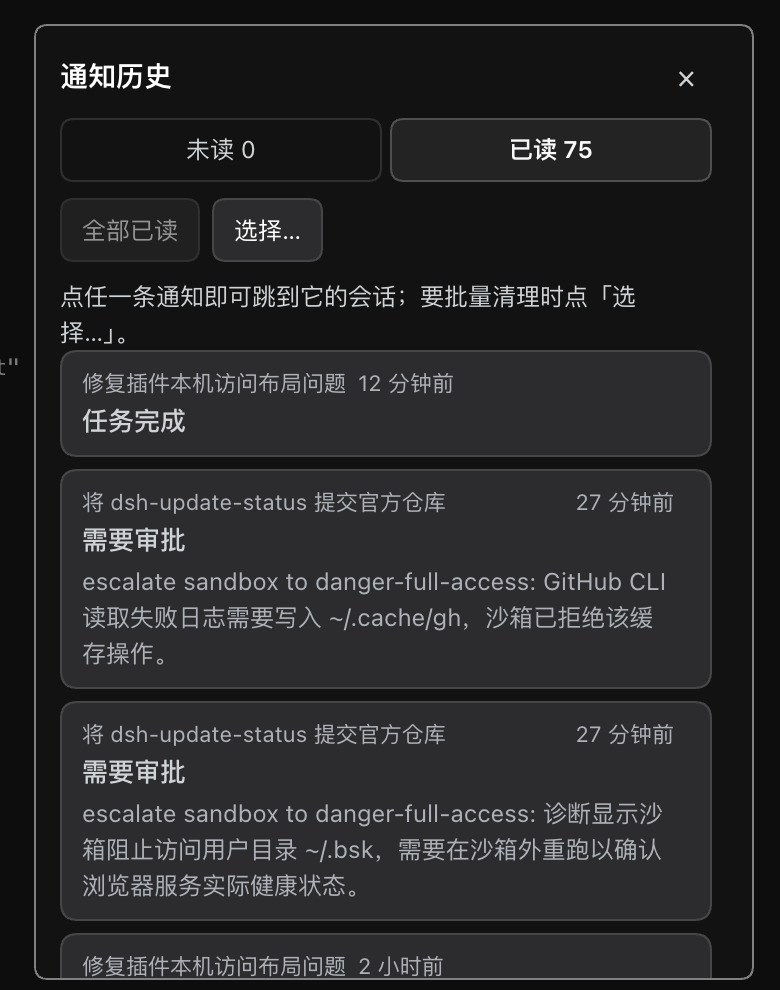
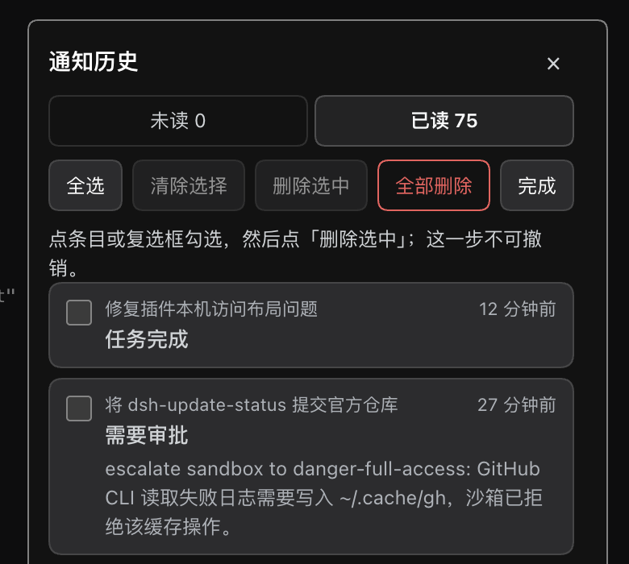
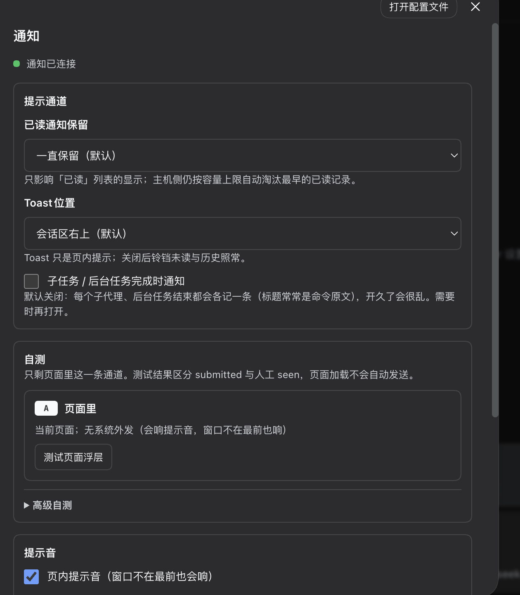
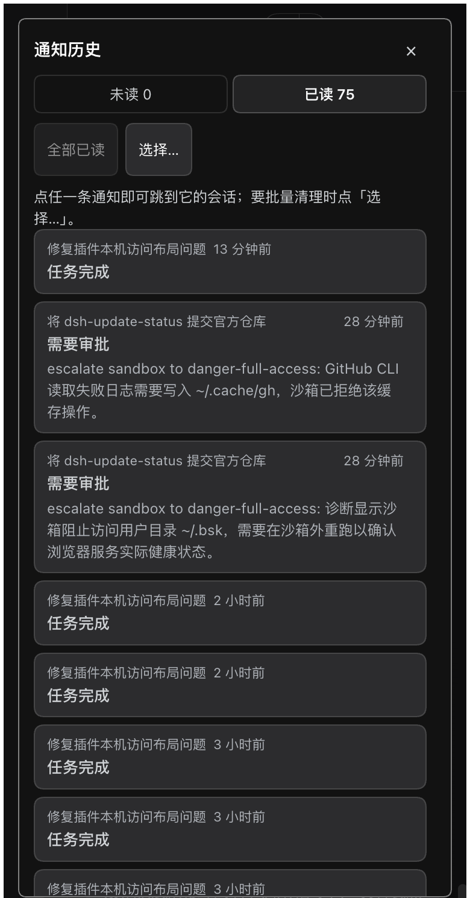

<h1 align="center">DSH Notify</h1>

<p align="center">In-page task notifications for DeepSeek Harness: a toast, a bell with history, a sound, and a flashing tab title.</p>

<p align="center">
  <a href="https://github.com/idoall/dsh-notify/actions/workflows/ci.yml"></a>
  <a href="LICENSE"></a>
  
</p>

<p align="center">English | <a href="README.zh.md">中文</a></p>

<p align="center">
  <a href="#what-it-does">What it does</a> ·
  <a href="#quick-start">Quick start</a> ·
  <a href="#usage">Usage</a> ·
  <a href="#settings">Settings</a> ·
  <a href="#compatibility">Compatibility</a> ·
  <a href="#uninstall">Uninstall</a> ·
  <a href="CHANGELOG.md">Changelog</a>
</p>

> DSH Notify is a DeepSeek Harness community plugin. It sits in the official sidebar action row and settings section, and does not modify DSH source.

When a session finishes a turn, fails, asks a question, or needs approval, a toast appears in the top-right corner of the current page. The bell in the sidebar keeps the history: unread and read tabs, one click to jump back to the session that produced the notification, and — for questions and approvals — answering straight from the toast.

Everything happens **inside the page you already have open**. There is no service worker, no web push, no host-side OS notification, and no extra app to install: browser and operating-system notification matrices were removed on purpose, because they fail invisibly (submitted, never seen) and cannot be made reliable across platforms.

<p align="center">
  
</p>

## What it does

- **Toast on the page**: title, body, session name, tone colour per kind, a close button, and a countdown bar. Click the body to jump to the session; click the answers to reply without leaving the page.
- **Answer in the toast**: a pending question or approval renders the same options as the composer. Answering here and answering in the composer act on the same pending interaction, so the two stay in sync.
- **Bell with history**: unread/read tabs, session name and relative time per entry, paging, “mark all read”, and batch delete behind a **Select…** trigger (nothing destructive is one click away).
- **Jump to the exact turn**: clicking an entry opens the session and scrolls to (and briefly highlights) the turn the notification came from.
- **Sound that survives being in the background**: synthesised in-page with WebAudio (no audio files shipped), plus uploadable custom sounds. It plays **even when the page is hidden** — that is the only way to reach you when the browser is behind another app.
- **Flashing tab title**: while the tab is in the background with something unread, the title gets a 🔔 prefix and the favicon alternates to a red dot. It stops the moment you look at the tab or nothing is unread.
- **Read state you can trust**: confirming a notification updates the bell count immediately, while the row fades in place (secondary border and text) and only moves to the read list when the list is reopened.
- **Per-profile history**: the record lives in the profile-owned data directory. Reloading the page, restarting DSH, or opening the GUI in another browser on the same Host shows the same history.
- **Opt-in noise**: subtask and background-job completion notifications are **off by default** (they fire for every subagent and job, which gets noisy fast). Read retention is configurable (keep forever / hide after 1, 7 or 30 days).

<p align="center">
  
  
</p>

## Quick start

Requirements:

- DeepSeek Harness with a Web profile
- Node.js 20 or newer
- Verified DSH version: `0.1.5-rc.1` (plugin `0.1.0`)

Install from GitHub into your Web profile:

```sh
dsh plugin --profile web add "github:idoall/dsh-notify"
```

From a local clone (what this repository is developed against):

```sh
git clone https://github.com/idoall/dsh-notify.git
cd dsh-notify
npm install
npm run build
dsh plugin --profile web add "link:$(pwd)"
```

Restart DSH and refresh the Web UI. The client half registers the bell in `sidebar.footer.action`, the settings card in `settings.section`, and the toast in `shell.overlay`; the host half mounts through `cordis.patch.yml`.

> **Name note:** the npm package `dsh-notify` belongs to a **different** author (a Windows tray/toast plugin). This plugin is not published on npm — install it from GitHub or from a local clone exactly as shown above, so a plain `dsh plugin add dsh-notify` cannot pull the wrong plugin.

## Usage

1. Run a task. When a turn completes, fails, or asks something, a toast appears in the top-right corner and the bell shows a count.
2. Click the toast to open the session it came from; click an answer button to answer in place; click **×** to dismiss (a settled notification is marked read, an open question is not).
3. Open the bell for history. Click any row to jump to its session and turn. Use **Select…** to check rows and delete them, or to delete everything.
4. Switch to another tab and keep working: the title flashes while something is unread and the sound plays when a turn finishes, even though the DSH page is in the background.
5. Everything is remembered per profile, so a reload does not lose the history.

## Settings

**Settings → Notifications**:

<p align="center">
  
</p>

| Setting | Default | What it does |
| --- | --- | --- |
| Read retention | keep forever | Hides older **read** entries from the read list (1 / 7 / 30 days). Unread entries are never hidden; the host still evicts the oldest read records by capacity. |
| Toast position | conversation column, top-right | Anchors the toast to the chat column, so it follows the conversation pane when the right sidebar is open or closed. |
| Subtask / background job notifications | **off** | Each subagent and each background job would otherwise record an entry (titles often being raw commands). |
| In-page sound | **on** | WebAudio cue on every new toast, **including while the page is hidden**. Built-ins: chime, ping, alert, silent — plus custom uploads. |
| Self-test | — | One card for the only channel (in-page), plus an advanced section (persisted history, navigation and unread, storage round-trip, deduplication). Tests never fire on page load. |

Custom sounds are uploaded to `<dataDir>/sounds/` in the profile data directory (not the plugin install directory), so reinstalling the plugin keeps them. Uploads are limited to 1 MB and to `mp3 / m4a / aac / wav / ogg / flac`; the file name must be a single path segment (no `../`, no subdirectories).

## Compatibility

Current release: plugin **`0.1.0`** is verified against DeepSeek Harness **`0.1.5-rc.1`**.

| Plugin | Verified DeepSeek Harness |
| --- | --- |
| `0.1.0` | `0.1.5-rc.1` |

Newer DSH releases are not auto-declared compatible. If a future DSH breaks the plugin, disable or uninstall it — do not patch DSH core.

Verified on macOS (Chrome and the DSH desktop shell) and remotely through a phone browser on the same Host. The layout adapts to narrow viewports: the toast and the history panel become full-width, and the panel is promoted to the browser top layer so a fixed mobile sidebar cannot cover it.

<p align="center">
  
</p>

## Uninstall

```sh
dsh plugin --profile web remove dsh-notify
```

Uninstalling does not delete the notification history or the uploaded sounds; they live in the data directory your profile patch owns (`config.dataDir`). Delete that directory to wipe them.

## Development

```sh
npm install
npm run verify     # typecheck + tests + build + package check
npm run test       # node --test test/*.test.js
npm run build      # dist/index.js, dist/client.js
```

The repository keeps the host half (`src/index.js`, `src/core.js`, `src/storage.js`, `src/sounds.js`), the client half (`src/client.js`), and a dependency-free test suite (`test/`). `dist/` is build output and is not committed.

## License

MIT. See [LICENSE](LICENSE).
