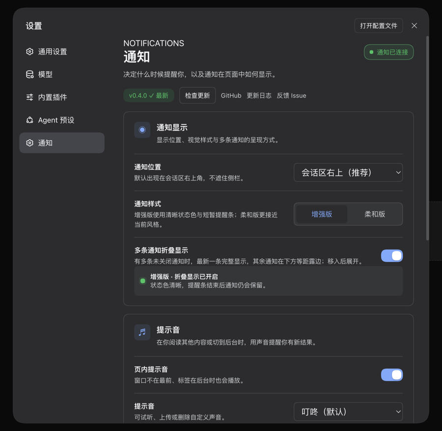

<h1 align="center">DSH Notify</h1>

<p align="center">In-page task notifications for DeepSeek Harness: clear status toasts, a collapsible stack, sound, and background-tab attention. Live delivery only — notification records are never stored.</p>

<p align="center">
  <a href="https://github.com/idoall/dsh-notify/actions/workflows/ci.yml"></a>
  <a href="https://www.npmjs.com/package/@idoall/dsh-notify"></a>
  <a href="LICENSE"></a>
  
</p>

<p align="center">English | <a href="README.zh.md">中文</a></p>

<p align="center">
  <a href="#what-it-does">What it does</a> ·
  <a href="#quick-start">Quick start</a> ·
  <a href="#settings">Settings</a> ·
  <a href="#compatibility">Compatibility</a> ·
  <a href="#uninstall">Uninstall</a> ·
  <a href="CHANGELOG.md">Changelog</a>
</p>

> DSH Notify is a DeepSeek Harness community plugin. It registers only a settings section and an in-page overlay; it does not modify DSH source.

When a session really stops, fails, asks a question, or needs approval, a card appears in the top-right corner of the current page. A green **Task completed** card follows DSH's native `agent/status: idle` transition — the same state that stops the session-tree spinner — rather than the earlier moment when text first looks complete. Intermediate goal rounds and queued follow-up turns stay quiet. Everything happens in the page you already have open: there is no service worker, web push, host OS notification, or notification history.

<p align="center">
  
</p>

## What it does

- **Enhanced or soft toast styling.** The default **Enhanced** style gives each notification a clear status colour and a short four-second attention bar; the bar is attention only, not a dismissal timer. **Soft** is a lower-key alternative. A card remains until you close it, open its session, or complete an in-card answer.
- **A collapsible page-local stack.** With **Collapse multiple notifications** enabled (the default), the second card and onward form a pile: the newest card is fully readable on top, while earlier cards remain complete underneath and expose equal `18px` lower edges. Pointer entry or keyboard focus expands the pile. The page keeps up to 50 live cards; pending actions are prioritised before ordinary cards, then newer cards come first.
- **Direct, traceable navigation.** Clicking a card opens its session and the exact originating turn. After the host selects that session, the selected row is smoothly revealed in the left session tree, even when it lives in a different off-screen workspace. A card stays put with an explanation if navigation cannot succeed.
- **Answer in the toast.** A pending question or approval renders the same compatible options as the composer. Execution approvals and plan reviews share DSH's amber decision colour; ordinary questions remain blue. In-card and composer answers share the same host interaction.
- **Sound and background attention.** Built-in WebAudio cues and validated custom uploads play only after a card is admitted to an enabled visual Toast queue, including while the page is hidden. One polling batch produces one cue. A background tab with unseen notifications receives a temporary bell prefix and favicon attention marker.
- **Completion means native idle, once per task.** A green card waits until DSH reports the owning Agent as `idle`, matching the session-tree spinner instead of guessing from a rendered answer or an elapsed timer. A plan review and an execution approval are control gates, so their temporary idle pause does not create an extra completion card; the later work turn supplies the one card. An ordinary question is different: if its answer directly finishes the task, that same turn still produces one green card. If work resumes, the prior candidate is cancelled and only the final native-idle transition is announced.
- **Task-noise control.** Subtask, background-job, and workflow completion notifications are off by default.
- **Online version detection.** The settings page shows the running version against the newest one published on npm, with **Check for updates**, GitHub, Changelog and Issues links. The check is read-only: the host asks the registry, reports, and shows a copyable upgrade command — it never installs anything and never restarts DSH. An unreachable registry renders as a failed check instead of presenting the running version as the newest.
- **No history by design.** Notification records are held only in the open page's in-memory queue. Settled history is never replayed after a refresh or overlay remount; an interaction that is still open when the host can report it is restored silently.

## Quick start

Requirements:

- DeepSeek Harness with a Web profile
- Node.js 20 or newer
- Verified DeepSeek Harness version: `0.1.7-rc.1`

Install from npm into your Web profile:

```sh
dsh plugin --profile web add @idoall/dsh-notify@latest
```

Install from GitHub:

```sh
dsh plugin --profile web add "github:idoall/dsh-notify"
```

From a local clone:

```sh
git clone https://github.com/idoall/dsh-notify.git
cd dsh-notify
npm install
dsh plugin --profile web add "link:$(pwd)"
```

Reload the profile or restart DSH only when its plugin host has not hot-reloaded the client. The client registers `settings.section` and `shell.overlay`; the host mounts through `cordis.patch.yml`.

> **Name note:** the unscoped npm name `dsh-notify` belongs to another author. Install this plugin as **`@idoall/dsh-notify`**. Its internal Cordis name, mount id, and `/plugins/dsh-notify/*` routes remain `dsh-notify`.

## Settings

**Settings → Notifications** provides a compact preview-first control surface:

<p align="center">
  
</p>

| Setting | Default | What it does |
| --- | --- | --- |
| Toast position | conversation top-right | Anchors the overlay to the chat column and follows sidebar layout changes. |
| Notification style | **Enhanced** | Enhanced uses clear status colours and a short attention bar; Soft uses a quieter presentation. |
| Collapse multiple notifications | **on** | From two cards onward, show the newest card fully and stack older cards below it; hover or focus expands them. |
| In-page sound | **on** | Plays one cue when a polling batch admits one or more new visible Toasts, including while DSH is in a background tab. Built-ins: chime, ping, alert, silent; custom uploads are supported. |
| Subtask / background completion | **off** | Enables notifications for subagents, background jobs, and workflows, which can otherwise be noisy. |
| Preview and self-test | — | Sends page-local examples only: **Completed**, **Confirm**, **Failed**, **Info**, replay all four styles, fold the active examples, or clear them. No test sends a system notification or changes a real task. |

Custom sounds are stored in `<dataDir>/sounds/` in the profile data directory, not the plugin installation. Uploads are limited to 1 MB and `mp3 / m4a / aac / wav / ogg / flac`; names must be a single path segment.

Above the cards, the page shows the running version against the newest one on npm: `v0.4.0 ✓ 最新`, `v0.4.0 ➔ v0.5.0`, or `v0.4.0 · 检查失败`. **检查更新** forces a fresh lookup (`GET /plugins/dsh-notify/update?force=1`, authenticated); a page load reuses the host's six-hour cache. When a newer version exists the row reveals `dsh plugin --profile web add @idoall/dsh-notify@<version>` with a copy button — installing it, and restarting DSH afterwards, stays your decision.

<p align="center">
  
</p>

## Compatibility

Current release: plugin **`0.4.0`** is verified against DeepSeek Harness **`0.1.7-rc.2`**.

| Plugin | Verified DeepSeek Harness | What that version is |
| --- | --- | --- |
| **`0.4.0`** | `0.1.7-rc.2` | Online version detection in 设置 → 通知: the running version against npm's newest, a manual **检查更新** (`?force=1`), repository/changelog/issues links, and a copyable upgrade command — read-only, cached, and it never installs or restarts anything |
| `0.3.4` | `0.1.7-rc.1` | Trigger-timing fixes: a failure is delivered at `agent/error` (one card with `turn/end`), a same-stack `idle → running` flap no longer announces a finished task, and the client pulls at once on a session-state change or a visible-again tab (1.5 s interval kept as fallback) |
| `0.3.3` | `0.1.7-rc.1` | Adapts to DSH 0.1.7: job completions follow `jobs.events.subscribe`, tool results read the flattened tool-role message, in-toast answers read `uiSession.sessionStatus`, and `@deepseek-ai/schemastery` is a peer |
| `0.3.2` | `0.1.6-alpha.1` | Completion follows native `agent/status: idle`; one green card per continuous task |
| `0.3.1` | `0.1.6-alpha.1` | Sound matches visible delivery; open interactions recover after overlay remount |
| `0.3.0` | `0.1.6-alpha.1` | Enhanced/soft styles, collapsed stack, and page-local self-test |
| `0.2.2` | `0.1.6-alpha.1` | Latest published npm `latest` until `0.3.3` is released |
| `0.2.1` | `0.1.6-alpha.1` | — |
| `0.2.0` | `0.1.6-alpha.1` | — |
| `0.1.2` | `0.1.6-alpha.1` | — |

- **`0.3.3` supports the DSH `0.1.7` line only.** DSH `0.1.7` removed `jobs.onJobDone`, flattened tool-result identity onto the tool-role message, and replaced `uiSession.pendingInteractions` with the unified `sessionStatus` snapshot. On an older DSH — including `0.1.6-alpha.1` — stay on plugin **`0.3.2`**.
- Two declarations make the `0.1.7` line load at all: `dsh.engines.dsh` and every `@deepseek-ai/dsh-*` peer declare `>=0.1.7-rc.1 <0.2.0`. DSH `0.1.7-rc.1` refuses an incompatible bundle at profile load, so a range that excluded the running release would silently drop the plugin.
- `@deepseek-ai/schemastery` is a **peer**, not a plain dependency: DSH 0.1.7 resolves only a linked plugin's peer dependencies from the running installation, so a `link:` install of this directory would otherwise fail to import the Host half.

The layout is also checked at a 390px mobile viewport: the settings controls reflow and the toast becomes full-width without falling behind the mobile sidebar.

<p align="center">
  
</p>

## Uninstall

```sh
dsh plugin --profile web remove @idoall/dsh-notify
```

Uninstalling does not delete uploaded sounds or `settings.json` in the profile data directory. Notification records are never written to disk.

## Development

```sh
npm install
npm run verify     # typecheck + tests + build + package check
npm run test       # node --test test/*.test.js
npm run build      # dist/index.js, dist/client.js
npm run pack:check # publish preconditions + client registration check
```

## Releasing

Releases are tag-driven. Bump `package.json`, move the matching CHANGELOG section out of `Unreleased`, write `release-notes/v<version>.md`, then push the release commit and tag:

```sh
git tag v0.4.0
git push origin v0.4.0
```

The release workflow runs `npm run verify`, packs the plugin, publishes through npm trusted publishing (OIDC), and creates a GitHub Release with the package tarball and sha256.

## License

MIT. See [LICENSE](LICENSE).
